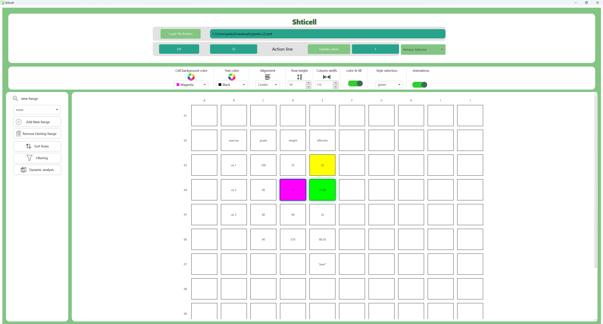

<h1 align="center">
  
   
  Welcome to Shticell
  
</h1>

<h2 align="center">
   A dynamic JavaFX-based spreadsheet application with customizable design, real-time updates, sorting, filtering, version control, and more!
           
*:new:* &nbsp; &nbsp; Now with advanced analysis and design customization features. &nbsp; &nbsp;  *:new:*
</h2>

 

# Table of Contents
* [Core Functionalities](#core-functionalities)
* [Advanced Features](#advanced-features)
* [Upcoming Features](#upcoming-features)
* [Installation](#installation)
* [Run](#run)
* [Configuration](#configuration)
* [Credits](#credits)

 

# :heavy_check_mark: **Core Functionalities** <a name="core-functionalities"/>
1. **Dynamic Spreadsheet**:
   - Real-time updates: Changes are reflected instantly.
   - Action Line Display: Provides detailed cell information including original value, effective value, and version history.
     
\
\
2. **Version Control**:
   - Track changes with version control.
   - Easily select and view previous versions, and revert if necessary.

\
\

3. **Dependency Management**:
   - Visualize cell dependencies and influences through color-coded highlights.
   - Automatic recalculation of dependent cells to ensure data integrity.

\
\

4. **Custom Design Bar**:
   - Customize background and text colors.
   - Adjust column widths and row heights dynamically for better layout and design.

 

5. **Dynamic Analysis**:
   - Perform trend analysis on ranges of numerical values.
   - Customize range and step size for iterative calculations.
   - Visualize how changes affect dependent cells in real-time.

6. **Data Sorting and Filtering**:
   - Multi-criteria sorting: Sort data by multiple columns.
   - Filter rows based on dynamic criteria or column values, helping display relevant information quickly.

 

# :gear: **Advanced Features** <a name="advanced-features"/>

1. **Expression Handling**:
   - Support for arithmetic functions (`PLUS`, `MINUS`, `TIMES`, `DIVIDE`).
   - Logical functions (`IF`, `AND`, `OR`) for conditional behavior.
   - Cell referencing (REF): Automatically update dependent cells based on references.

2. **Custom Skins and Animations**:
   - Choose from multiple skins (green, red, blue).
   - Enjoy interactive animations with pop-ups and button hover effects.

 

# :construction_worker: **Upcoming Features** <a name="upcoming-features"/>
1. **Advanced Expression Parsing**: 
   - Support for complex arithmetic and logical functions.

2. **Data Export**:
   - Export spreadsheet data to CSV, Excel, and other formats.

3. **Enhanced Visualization**:
   - Include built-in charts and graphs for data analysis.

 

# :wrench: **Installation** <a name="installation"/>

1. Download the project files from the repository.

2. Set up the JavaFX environment in your preferred IDE (IntelliJ IDEA, Eclipse).

3. Ensure all dependencies for JavaFX are installed.

 

# :arrow_forward: **Run** <a name="run"/>

1. Run the `ShticellMain` class to start the application.

2. The user interface will load, and you can begin interacting with the spreadsheet.

 

# :gear: **Configuration** <a name="configuration"/>

1. Customize skins via the **Style ComboBox** in the settings.
2. Adjust animation behaviors for a personalized experience.

# :trophy: **Credits** <a name="credits"/>
> Created by: Yael Yakobovich

 
