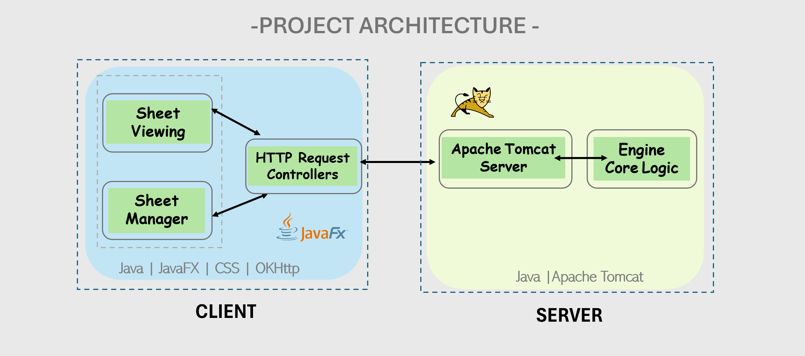
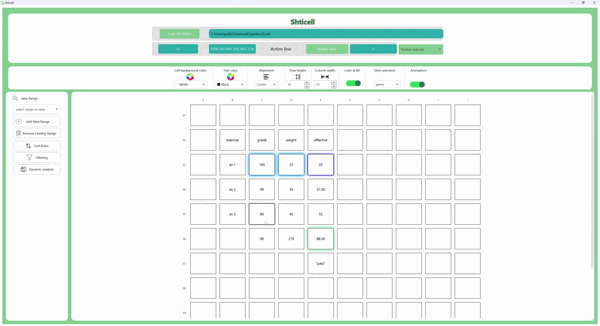

<h1 align="center">
  
   
  Welcome to Shticell
  
</h1>

<h2 align="center">
  A Multi-User Spreadsheet Server Application with Tomcat Integration
           
</h2>

 

# Table of Contents
* [Features](#Features)
* [Login Screen](#login-screen)
* [Core Functionalities](#view-sheet-screen-core-functionalities)
* [Advanced Features](#advanced-features)
* [Upcoming Features](#upcoming-features)
* [Installation](#installation)
* [Run](#run)
* [Configuration](#configuration)
* [Credits](#credits)

 

### 📌 About the project

# **Features** <a name="Features"/>
   - Users can see an ordered list of all the sheets they have uploaded
   - Multi-user collaboration via server integration.
   - Customizable design and formatting.
   - Sorting, filtering, and version control.
   - Permission-based access for collaborative editing.
           

# :lock: **Login Screen** <a name="login-screen"/>
   - Users must enter their username to log in.
   - If the username already exists, the system notifies the user and prompts them to enter a different name.
          

# :bulb: **Sheet Management Screen** <a name="sheet-management-screen"/>
\
\

1. **View Uploaded Sheets**:
   - Users can see an ordered list of all the sheets they have uploaded.

2. **Permission Requests Management**:
   - Users can view permission requests for each sheet they uploaded.
   - For each request, the user's username, requested permission type, and the approval status are displayed.
   - Sheet owners can approve or reject permission requests.

3. **Request Permissions**:
   - Users can select any sheet in the system and request permission from the owner.
   - Requests can be for READER (view-only) or WRITER (editing) permissions.

           

# :heavy_check_mark: **View Sheet Screen- Core Functionalities** <a name="view-sheet-screen-core-functionalities"/>

\
\

1. **Dynamic Spreadsheet**:
   - Real-time updates: Changes are reflected instantly.
   - Action Line Display: Provides detailed cell information including original value, effective value, and version history.
     
\
\
2. **Version Control**:
   - Track changes with version control.
   - Easily select and view previous versions, and revert if necessary.

\
\

3. **Dependency Management**:
   - Visualize cell dependencies and influences through color-coded highlights.
   - Automatic recalculation of dependent cells to ensure data integrity.

\
\

4. **Custom Design Bar**:
   - Customize background and text colors.
   - Adjust column widths and row heights dynamically for better layout and design.

 

5. **Dynamic Analysis**:
   - Perform trend analysis on ranges of numerical values.
   - Customize range and step size for iterative calculations.
   - Visualize how changes affect dependent cells in real-time.

6. **Data Sorting and Filtering**:
   - Multi-criteria sorting: Sort data by multiple columns.
   - Filter rows based on dynamic criteria or column values, helping display relevant information quickly.

 

# :gear: **Advanced Features** <a name="advanced-features"/>

1. **Expression Handling**:
   - Support for arithmetic functions (`PLUS`, `MINUS`, `TIMES`, `DIVIDE`).
   - Logical functions (`IF`, `AND`, `OR`) for conditional behavior.
   - Cell referencing (REF): Automatically update dependent cells based on references.

2. **Custom Skins and Animations**:
   - Choose from multiple skins (green, red, blue).
   - Enjoy interactive animations with pop-ups and button hover effects.

 
 

# :wrench: **Installation** <a name="installation"/>

1. **Download the Project Files**:
   - Clone or download the project files from the repository.

2. **Set Up the JavaFX Environment**:
   - Open the project in your preferred IDE (e.g., IntelliJ IDEA, Eclipse).
   - Ensure all dependencies for JavaFX are installed.

3. **Set Up the Server**:
   - Install Apache Tomcat or another servlet container.
   - Deploy the server code by copying the WAR file to the Tomcat webapps directory or configuring deployment through your IDE.
   - Set the context path to web-Shticell_Web.
  
 

# :arrow_forward: **Run** <a name="run"/>

1. **Run the Server**:
   - Build the server-side code and start the Tomcat server.
   - Verify the server is running by accessing http://localhost:8080/web-Shticell_Web.

2. **Run the Client**:
   - Run the JavaFX client application from your IDE..
   - The client interacts with the server to provide spreadsheet functionalities.

 

# :gear: **Configuration** <a name="configuration"/>

1. Customize skins via the **Style ComboBox** in the settings.
2. Adjust animation behaviors for a personalized experience.

# :trophy: **Credits** <a name="credits"/>
> Created by: Yael Yakobovich

 
